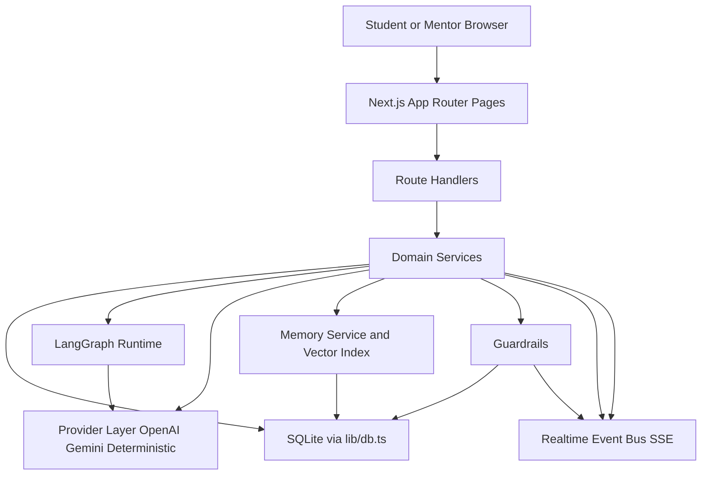
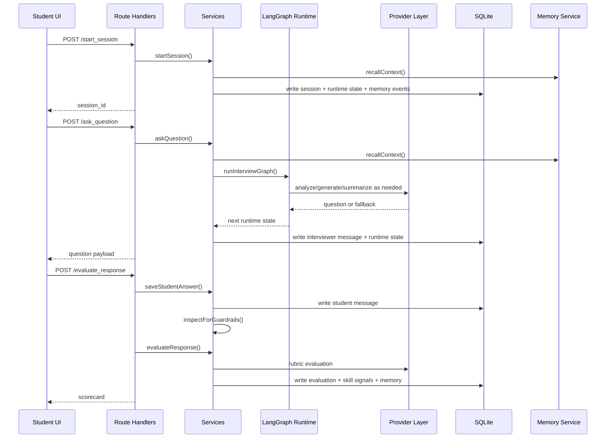

# App Workflow And Architecture

This document explains how the app works end to end: what the user sees, which routes fire, which services run, what gets stored, and how the student, AI runtime, memory system, guardrails, and mentor tools connect.

It is written as a system walkthrough, not just a file list.

## 1. What This App Is

This project is a local-first mock interview platform with five major subsystems:

1. Authentication and role access
2. Interview setup and resume-based personalization
3. Live interview orchestration with AI and deterministic fallbacks
4. Evaluation, memory, and longitudinal insights
5. Guardrails, mentor review, and live intervention

At runtime, the app is a Next.js App Router application backed by local SQLite, with:

- server-rendered pages for the main product surfaces
- route handlers for interview APIs
- a LangGraph-based interview runtime
- a local semantic memory layer
- a lightweight Server-Sent Events channel for live updates

## 2. High-Level Architecture

## 3. Main Layers

| Layer | Main files | Responsibility |
| --- | --- | --- |
| Pages and UI | `app/*`, `components/*` | The browser-facing product: login, setup, interview, results, history, insights, mentor dashboard |
| Route handlers | `app/**/route.ts` | Validate requests, enforce auth, call services, return JSON |
| Domain services | `lib/services/*` | Business logic for sessions, orchestration, evaluation, guardrails, mentor actions, memory |
| Agent runtime | `lib/agent/runtime.ts`, `lib/agent/config.ts`, `agent_config/*` | Multi-step interview state machine and prompt assembly |
| Provider layer | `lib/ai/provider.ts` | OpenAI, Gemini, or deterministic fallback for analysis, questioning, summarization, evaluation |
| Persistence | `lib/db.ts`, `lib/db-schema.ts` | SQLite-backed storage for users, sessions, messages, evaluations, memory, flags, mentor actions |
| Memory | `lib/memory/*`, `lib/services/memory-service.ts` | Event storage, vector indexing, semantic recall, weak-skill history |
| Safety and mentor tooling | `lib/services/guardrail-service.ts`, `lib/services/mentor-service.ts` | Flag creation, mentor queue, mentor feedback, takeover |
| Realtime | `lib/realtime/event-bus.ts`, `app/events/stream/route.ts` | SSE updates for student and mentor views |

## 4. User Roles And Entry Points

### Student

Primary pages:

- `/`
- `/login`
- `/setup`
- `/interview/[sessionId]`
- `/results/[sessionId]`
- `/history`
- `/insights`

Primary APIs:

- `POST /auth/signup`
- `POST /auth/login`
- `POST /resume/parse`
- `POST /profile/resume`
- `POST /start_session`
- `POST /evaluate_response`
- `POST /ask_question`
- `GET /session/[sessionId]/summary`
- `POST /session/[sessionId]/end`

### Mentor

Primary pages:

- `/mentor/login`
- `/mentor`
- `/mentor/flags/[flagId]`

Primary APIs:

- `POST /auth/signup` with `account_type=mentor`
- `POST /auth/login` with `required_role=mentor`
- `POST /mentor/feedback`
- `POST /mentor/takeover`
- `PATCH /flags/[flagId]`
- `GET /events/stream?scope=mentor`

Mentor access is not a separate auth system. It uses the same local auth system with role checks in `lib/auth.ts`.

## 5. Authentication Workflow

Main files:

- `lib/auth.ts`
- `app/auth/signup/route.ts`
- `app/auth/login/route.ts`
- `components/auth/auth-panel.tsx`
- `app/login/page.tsx`
- `app/mentor/login/page.tsx`
- `middleware.ts`

How it works:

1. The user signs up or logs in from the auth panel.
2. The route handler validates the payload with Zod.
3. `lib/auth.ts` hashes passwords with scrypt and stores them in SQLite.
4. On successful login, the app creates an auth session record and sets the `vantage_session` cookie.
5. Page-level guards like `requireCurrentUser()` or `requireMentorUser()` redirect unauthorized users.
6. API-level guards like `requireApiUser()` and `requireMentorApiUser()` reject unauthorized requests.

Mentor account creation:

- A mentor account can be created when either:
  - the email matches `MENTOR_EMAILS` or `ADMIN_EMAILS`
  - the shared `MENTOR_SIGNUP_CODE` is supplied

Host consistency in dev:

- `middleware.ts` redirects browser-style requests from `127.0.0.1` and `::1` to `localhost`
- this avoids auth-cookie split across different loopback hosts

## 6. Resume And Personalization Workflow

Main files:

- `components/forms/interview-setup-form.tsx`
- `app/resume/parse/route.ts`
- `app/profile/resume/route.ts`
- `lib/resume-parser.ts`
- `lib/personalization.ts`

How it works:

1. The student uploads a resume from the setup page.
2. The browser sends a multipart upload to `POST /resume/parse`.
3. `lib/resume-parser.ts` extracts text based on file type:
   - `.pdf` using `pdf-parse`
   - `.txt`, `.md`, `.html` directly
   - `.doc`, `.docx`, `.rtf` through macOS `textutil` when available
4. The parser normalizes and truncates resume text through `normalizeResumeText`.
5. The route returns:
   - `resume_text`
   - `file_name`
   - lightweight `resume_highlights`
6. The client then persists the parsed resume to `POST /profile/resume`.
7. The user record in SQLite is updated with:
   - `resume_text`
   - `resume_file_name`
8. During session start, the app derives a `recalled_context_summary` from:
   - resume highlights
   - recalled memory context

Important design note:

- resume parsing is text extraction, not OCR
- scanned image-only PDFs still fail if no readable text layer exists

## 7. Student Workflow: From Setup To Results

### Step 1: Configure The Session

Main files:

- `app/setup/page.tsx`
- `components/forms/interview-setup-form.tsx`
- `app/start_session/route.ts`
- `lib/services/session-service.ts`

The student chooses:

- target role
- mode: behavioral, technical, or case
- optional focus area
- confidence rating
- personalization on or off
- self-critique on or off
- optional notes
- optional resume

When they submit:

1. The client calls `POST /start_session`.
2. The route authenticates the user and validates input.
3. `startSession()` creates:
   - an `InterviewSession`
   - an initial `AgentSessionState`
4. If personalization is enabled, it recalls memory context before the interview even starts.
5. It also writes memory events such as:
   - `session_started`
   - `resume_profile` when a resume is present

### Step 2: Open The Live Interview

Main files:

- `app/interview/[sessionId]/page.tsx`
- `components/interview/live-interview-client.tsx`
- `app/session/[sessionId]/summary/route.ts`

How the page works:

1. The server loads the session summary.
2. The client boots with:
   - transcript
   - latest scores
   - runtime state
   - mentor flags and interventions
3. If there is no interviewer message yet, the page bootstraps the first question automatically.

### Step 3: Generate The First Question

Main files:

- `app/ask_question/route.ts`
- `lib/services/orchestrator-service.ts`
- `lib/agent/runtime.ts`
- `lib/ai/provider.ts`

How it works:

1. The client sends `POST /ask_question`.
2. If the request comes from the live page, it also sends a stateless context snapshot:
   - current transcript
   - current phase
   - recalled context items
   - weak skills
3. The orchestrator resolves:
   - persisted session
   - persisted transcript
   - weak skills
   - recalled context
   - runtime state
4. Because there is no previous answer yet, the LangGraph runtime takes the `first_turn` path.
5. It skips answer analysis and goes straight to speaker generation in the `opening` phase.
6. The provider layer generates the question through:
   - OpenAI when configured and available
   - Gemini when configured and available
   - deterministic fallback otherwise
7. The question is persisted as a `Message` with metadata like:
   - `question_type`
   - `current_phase`
   - `turn_type`
   - `question_source`

### Step 4: Student Answers

Main files:

- `components/interview/live-interview-client.tsx`
- `app/evaluate_response/route.ts`
- `lib/services/session-service.ts`
- `lib/services/evaluation-service.ts`

When the student submits an answer:

1. The client calls `POST /evaluate_response`.
2. The route:
   - verifies ownership
   - finds the matching interviewer message
   - persists the student answer with `saveStudentAnswer()`
3. `saveStudentAnswer()`:
   - creates a student `Message`
   - updates the session status to `active` or `flagged`
   - updates recent runtime messages
   - writes a short-term memory event
   - runs guardrail checks on the answer

### Step 5: Evaluate The Answer

Main files:

- `lib/services/evaluation-service.ts`
- `lib/evaluation/rubric-loader.ts`
- `lib/evaluation/rubric-selector.ts`
- `lib/evaluation/rubric-audit.ts`
- `lib/ai/provider.ts`

Evaluation flow:

1. The evaluation service selects a rubric by:
   - exact role and mode when possible
   - mode default otherwise
   - global default as the final fallback
2. It builds a structured evaluation prompt.
3. The provider layer returns a scorecard or falls back deterministically.
4. The scorecard is enriched with rubric-derived metadata:
   - overall score
   - strengths
   - weak skills
   - rubric coverage
5. The app persists an `EvaluationRecord`.
6. It writes episodic memory for the evaluation.
7. It records skill signals so future sessions can recall recurring strengths and weaknesses.

### Step 6: Ask The Next Question

After evaluation:

1. The client refreshes the session summary.
2. The client recalls fresh context through `POST /memory/recall_context`.
3. The client calls `POST /ask_question` again with:
   - latest answer
   - updated transcript
   - context items
   - weak skills

The LangGraph runtime now runs the full loop:

1. Build analyzer prompt
2. Analyze the latest answer
3. Optionally redirect analysis once to a suggested phase
4. Update runtime state
5. Refresh conversation summary when needed
6. Build speaker prompt
7. Generate the next interviewer turn

The runtime can choose among phases:

- `interview_setup`
- `opening`
- `interview_round`
- `deep_dive`
- `session_feedback`
- `mentor_review`

Design detail:

- `session_feedback` is terminal in practice
- once the runtime moves there, the session is now marked completed and the UI redirects to results

### Step 7: End The Session

The session can end in three ways:

1. The user clicks `End interview`
2. The answer limit is reached
3. The runtime decides to move into `session_feedback`

The completion path updates:

- session status to `completed`
- `ended_at`
- runtime phase to `session_feedback`
- runtime `turn_type` to `termination`
- `session_end_reason` in runtime metadata

### Step 8: Results, History, And Insights

Main files:

- `app/results/[sessionId]/page.tsx`
- `app/history/page.tsx`
- `app/insights/page.tsx`
- `lib/services/session-service.ts`

Results page shows:

- latest overall summary
- score cards
- STAR breakdown
- strengths
- improvement areas
- growth tips
- evaluator self-critique when enabled
- transcript preview

History page shows:

- prior sessions for the current user
- role, mode, date, current phase, and score summary

Insights page aggregates:

- recurring strengths
- recurring weak skills
- mode-specific score trends
- recommended focus areas

## 8. Interview Runtime Design

Main files:

- `lib/agent/runtime.ts`
- `lib/agent/config.ts`
- `agent_config/*`

The interview runtime is a LangGraph state machine.

Core runtime concepts:

- `current_phase`
- `previous_phase`
- `turn_count`
- `turn_type`
- `current_question_text`
- `current_question_type`
- `analyzer_output`
- `follow_up_targets`
- `conversation_summary`
- `flagged`
- `mentor_takeover_active`

Prompt system:

- prompt templates live in `agent_config/prompts/*.md`
- phase-specific skills live in `agent_config/skills/<phase>/*.md`
- phase rules live in `agent_config/phase_registry.json`
- state contract lives in `agent_config/state_schema.json`

Why it is designed this way:

- the runtime separates analysis from speaking
- phase transitions are explicit, not hidden in one giant prompt
- the state can be reconstructed from persisted data
- the app can operate with either live LLMs or deterministic fallbacks

## 9. Provider Layer Design

Main file:

- `lib/ai/provider.ts`

The provider layer handles:

- answer analysis
- interviewer question generation
- conversation summarization
- rubric-based evaluation

Provider selection:

1. OpenAI when configured and key is present
2. Gemini when configured and key is present
3. deterministic fallback otherwise

The deterministic path is not only a dead backup. It is also used intentionally when:

- no provider key is configured
- provider calls fail
- a generated behavioral question is considered a bad shape and replaced

New logging now records:

- analyzer provider
- fallback provider
- question source
- question fallback reason
- phase transitions
- session completion reason

## 10. Memory System Design

Main files:

- `lib/memory/service.ts`
- `lib/memory/repository.ts`
- `lib/memory/retriever.ts`
- `lib/services/memory-service.ts`

The memory system has three tiers:

- `short_term`
- `episodic`
- `long_term`

What gets stored:

- short-term:
  - latest student answers
  - live transcript fragments
  - current runtime state snippets
- episodic:
  - session started events
  - evaluation events
  - mentor events
  - guardrail events
- long-term:
  - resume profile
  - derived skill signals

How recall works:

1. Memory events are the source of truth.
2. Each event gets embedded into a local vector record.
3. On recall, the service can combine:
   - recent session context
   - semantic retrieval across memory vectors
   - long-term skill signals
4. Retrieved items are deduplicated and returned with `relevance_reason`.
5. Weak skills are computed separately and returned alongside context.

Important design choice:

- the app stores both structured event data and vectorized retrieval data
- this keeps memory explainable while still allowing semantic recall

## 11. Guardrails Workflow

Main files:

- `guardrails/policy.yaml`
- `lib/guardrails/policy-loader.ts`
- `lib/services/guardrail-service.ts`

How it works:

1. Student answers and interviewer outputs can be inspected against guardrail rules.
2. Rules come from `guardrails/policy.yaml`.
3. If a match occurs, the service:
   - creates one or more `FlagEvent` records
   - updates the session to `flagged`
   - updates runtime state
   - writes episodic memory events
   - emits realtime events to both student and mentor audiences

Current behavior:

- the student flow stays functional
- the mentor dashboard becomes aware of the flagged session
- the system does not require a hard stop for every flag

## 12. Mentor Workflow

Main files:

- `app/mentor/page.tsx`
- `app/mentor/flags/[flagId]/page.tsx`
- `components/mentor/*`
- `lib/services/mentor-service.ts`

How it works:

1. A mentor signs in through `/mentor/login`.
2. The mentor dashboard loads the open flag queue.
3. The mentor opens a flag detail page.
4. From there they can:
   - review transcript and evaluations
   - mark the flag reviewed
   - leave supplemental feedback
   - trigger takeover

Supplemental feedback:

- creates a mentor intervention
- writes episodic memory
- emits `session.mentor.feedback` to session and mentor streams

Takeover:

- creates a mentor intervention
- sets session status to `paused`
- sets runtime phase to `mentor_review`
- marks `mentor_takeover_active = true`
- emits `session.mentor.takeover`

Important limitation:

- takeover is a supervised pause/intervention model
- it is not yet a full two-way mentor-operated live interviewing console

## 13. Realtime Design

Main files:

- `app/events/stream/route.ts`
- `lib/realtime/event-bus.ts`
- `docs/socket-events.md`

Transport:

- Server-Sent Events, not WebSockets

Scopes:

- session scope: student session updates
- mentor scope: mentor dashboard updates

Current event types:

- `stream.connected`
- `session.flag.created`
- `session.flag.reviewed`
- `session.mentor.feedback`
- `session.mentor.takeover`

Important design limitation:

- the event bus is in-process memory
- live updates work well on a single app instance
- cross-instance fanout would need shared pub/sub in a real distributed deployment

## 14. Persistence Model

Main files:

- `lib/db.ts`
- `docs/schema.md`

Storage is local SQLite, typically at:

- `data/mockinterview.sqlite`

Key tables:

- `users`
- `auth_sessions`
- `sessions`
- `messages`
- `evaluations`
- `memory_events`
- `memory_vectors`
- `skill_signals`
- `flags`
- `mentor_interventions`
- `agent_session_states`
- `conversation_summaries`

The app uses SQLite for both transactional data and memory/vector metadata, which keeps the MVP simple and easy to inspect locally.

## 15. End-To-End Request Flow

## 16. Why The App Is Structured This Way

The current architecture favors:

- explicit state over hidden prompt state
- local inspectability over distributed complexity
- deterministic fallbacks over hard provider dependency
- explainable memory events over opaque long-context stuffing
- incremental mentor tooling over an overly ambitious live-admin system

That makes the app well-suited for:

- local development
- demos
- testing interview logic
- iterating on prompts, rubrics, and memory behavior

## 17. Current Constraints And Known MVP Edges

These are the main practical constraints in the current design:

- SQLite is local to the app instance
- realtime fanout is process-local, not distributed
- mentor takeover pauses and intervenes, but does not fully replace the AI interviewer UI
- scanned resume OCR is not implemented
- the question ceiling is intentionally small: `5` student answers per session
- the client uses multiple route calls per turn instead of one monolithic orchestration request
- some flows still depend on local environment correctness such as provider keys and dev hostname consistency

## 18. Related Docs

If you want deeper detail on a single subsystem, these existing docs are the next places to read:

- `docs/schema.md`
- `docs/socket-events.md`
- `docs/ai-system-scenarios.md`
- `docs/openapi.yaml`
